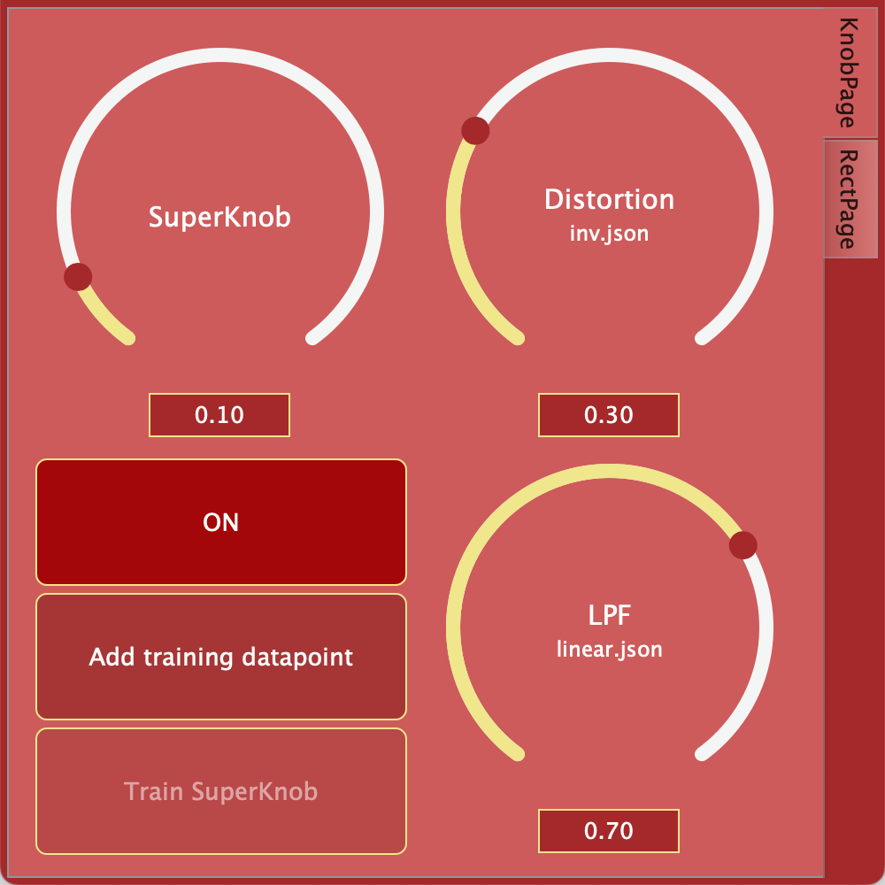
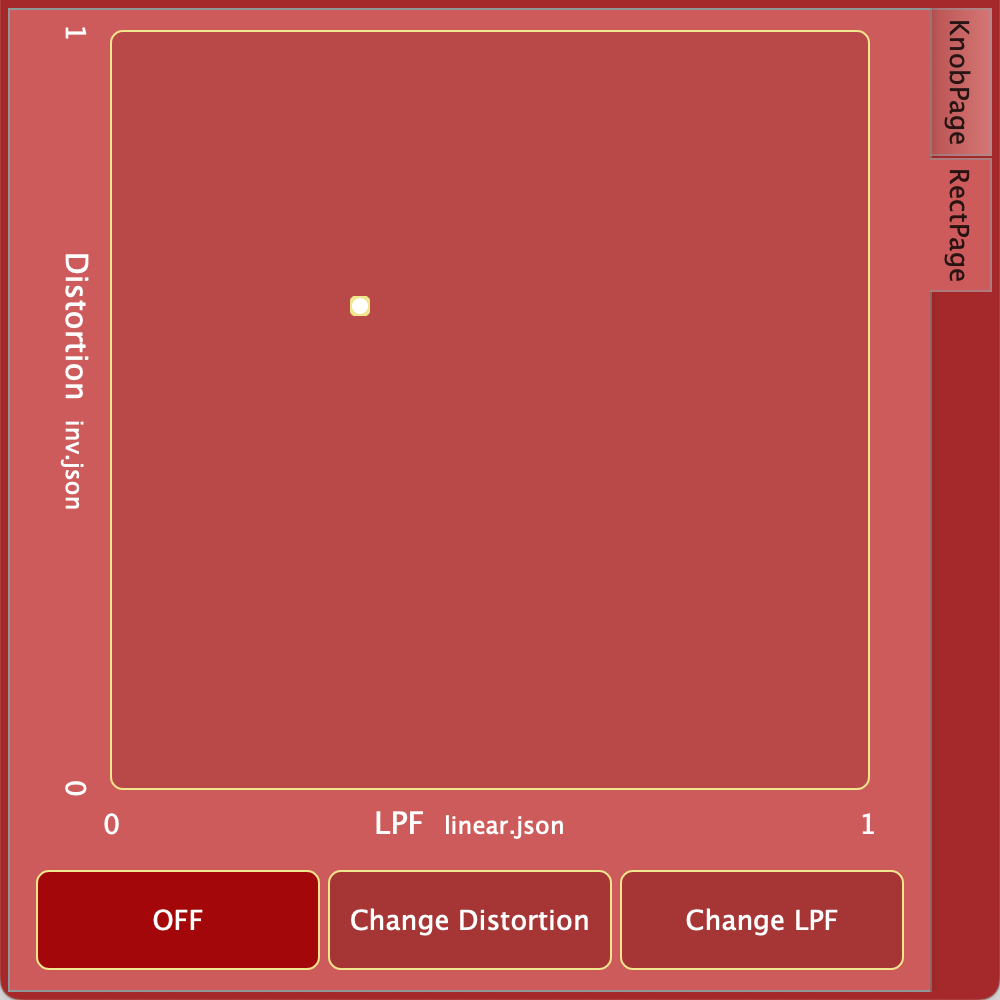

# MagicKnob
A plugin exploring different sound-design possibilities by using conditionally trained neural networks.

# Training and exporting
The training and exporting scipts are available for <a href="https://pytorch.org/">PyTorch</a>. We also experimented with <a href="https://www.tensorflow.org/">Tensorflow</a>, but the final and most recent work is based on torch.

To train our final models we used the train_param_LSTM16.ipynb notebook. The training files and respective results and models (in torch and json format) are available in the data and python/models folders respectively. 

To replicate the training process, the audio files should adopt the following naming convention to become part of a dataset.

- Input: {name}-input.wav
- Output: {param}-{name}-target.wav

Multiple input files, identified by a unique names, can be used in the training. The parameters can be expressed as integers of floats.

# MagicKnob Plugin
The plugin is developed in <a href="https://juce.com/">JUCE</a> with the help of the <a href="https://github.com/jatinchowdhury18/RTNeural">RTNeural</a> framework, used to import our json model files and to define neural architectures at compile time, meeting real-time requirements. 

The plugin is divided in 2 main tabs.
- KnobPage: here the user can control the distortion and LPF values both with the knobs on the right column, customized in order to cycle through the available models (linear, inverst, random, ...) when double-clicked. Another feature is the possibility to graphically train a neural network, linking the SuperKnob to the values of the other 2 dials. This network can be reset and re-trained whenever the user demands it.
- RectPage: here, the user has access to a Cartesian plane with distortion and LPF values on the axes. This space allows to explore the whole range of parameters freely. Buttons at the bottom of the page grant the possibility to cycle through the available models. 

| KnobPage                                      | RectPage             |
| ----------------------                        | ---------------------- |
|     |  |

# DEMO VIDEO
The video is available at this <a href="https://youtu.be/ppRN70sb_Lc">link</a>.